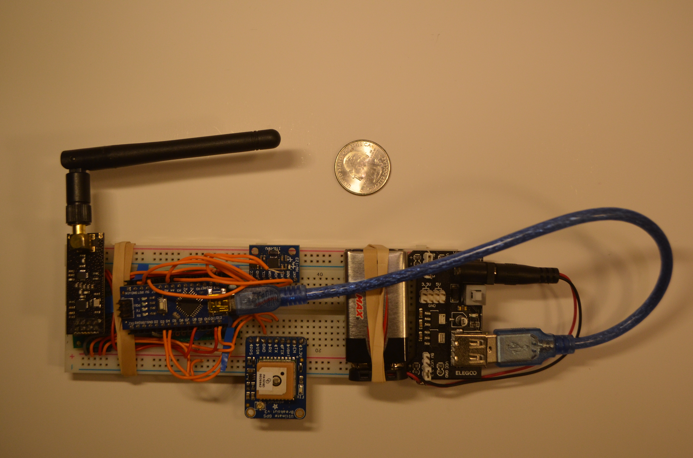
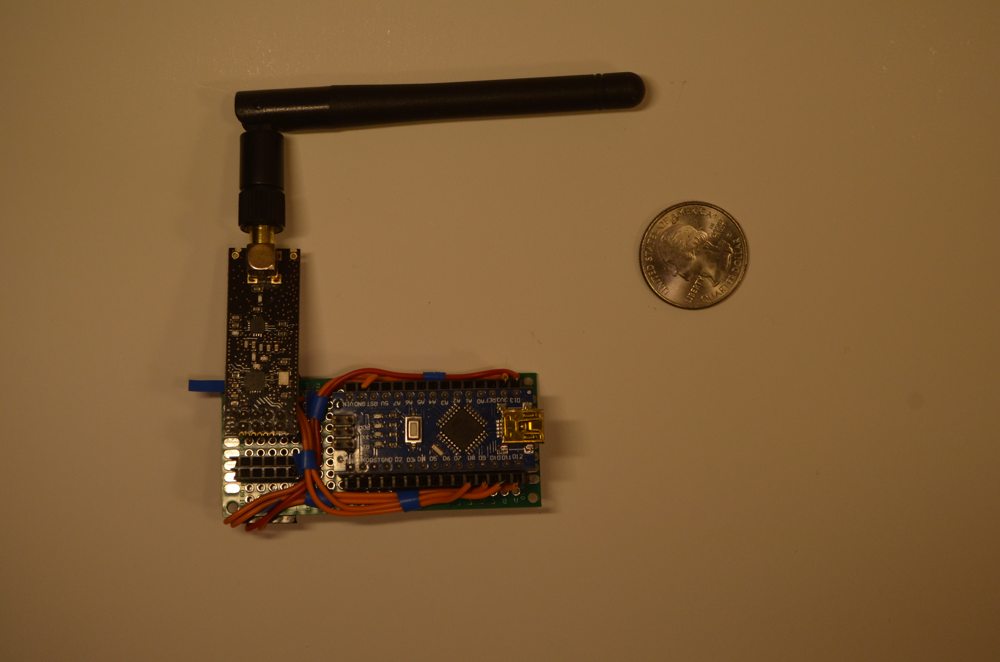
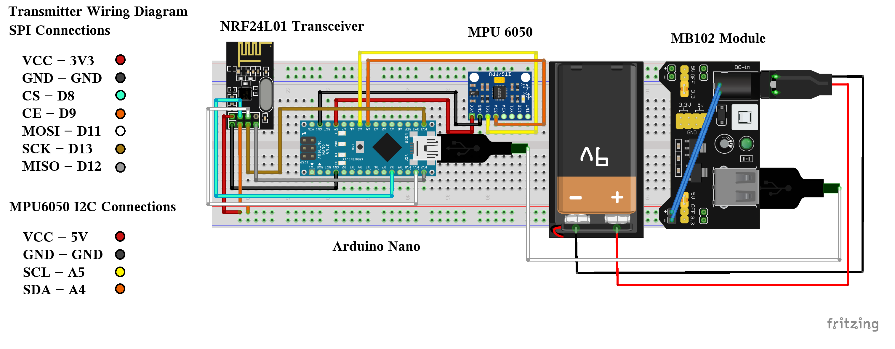
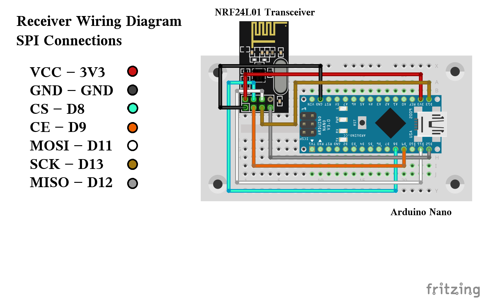
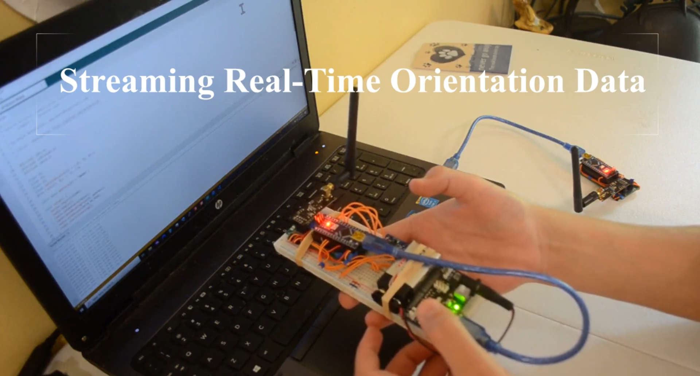

# Wireless Attitude Telemetry System

A wireless IMU telemetry system using NRF24L01 transceivers, Arduino Nano microcontrollers, and VPython real-time 3D visualization.

# Overview

This project transmits real-time orientation telemetry wirelessly from a custom transmitter module to a receiver module using NRF24L01 RF communication.

The transmitter processes MPU6050 inertial measurement unit (IMU) data and wirelessly streams pitch, yaw, and roll orientation values as an array. The receiver forwards the telemetry data over serial communication to a host computer, where the VPython application visualizes the orientation of the transmitter module in real time.

This project was developed through experimentation with embedded systems, wireless telemetry, IMU motion processing, and real-time visualization. 

# Notes

The embedded systems themselves necessitated soldering the NRF24L01 and Arduino Nano connections to guarantee reliability for the SPI connection. Aside from this, my first version of this wireless telemetry project worked well when drafted only with a breadboard and a soldered receiver module.

Some code focusing on parts other than the YawPitchRoll MPU6050 functionality can be deleted from the rf-orientation-telemetry program to optimize upload speeds, packet transmissions, and on-board memory storage. I, however, choose to add it in case I decide to upscale this project and fully take advantage of the MPU6050's capabilities. 

The transmitter module collects telemetry data by compiling the MPU6050's YawPitchRoll values into an integer array to keep packet sizes small and transmissions few. It then utilizes the RF24 library to collapse the packet's transmission into a radio.write() command, which fully sends the YawPitchRoll array in accordance with the specific address and packet size. 

# Features

      -Wireless RF telemetry transmission
      -Real-time pitch, roll, and yaw tracking
      -MPU6050 DMP motion processing
      -Arduino Nano transmitter and receiver modules
      -VPython 3D orientation visualization
      -NRF24L01 transceiver communication
      -USB serial telemetry streaming
      -Live orientation reconstruction and visualization

# System Architecture

      TRANSMITTER MODULE
      ────────────────────────
      MPU6050 IMU
            ↓
      Arduino Nano
            ↓
      NRF24L01 Telemetry Transmission
            ↓
      ════════ RF LINK ════════
            ↓
      NRF24L01 Receiver
            ↓
      Arduino Nano Receiver Module
            ↓
      USB Serial Communication
            ↓
      Host Computer
            ↓
      VPython Real-Time Visualization

# Hardware

  ## Transmitter Module
  
    -Arduino Nano
    -MPU6050 IMU
    -NRF24L01 RF Transceiver
    -MB102 Breadboard Power Module
    -9V Battery Supply
    
  ## Receiver Module
  
    -Arduino Nano
    -NRF24L01 RF Transceiver

# System Images

  ## Transmitter Module
  
   

  ## Receiver Module
  
  

# Wiring Diagrams

  
  
  

  
  

# Software

  ## Transmitter Firmware
  
   The transmitter firmware initializes the MPU6050 DMP system, processes orientation telemetry, and transmits yaw, pitch, and roll values wirelessly using NRF24L01 communication.

  ## Receiver Firmware
  
   The receiver firmware listens for incoming telemetry packets and forwards orientation data to the host computer through serial communication.

  ## VPython Visualizer
  
   The VPython visualization software reconstructs orientation data in real time and displays a live 3D representation of the transmitter module.

# Demonstration Video

Click the image below to watch the full system demonstration.

The demonstration showcases:

      -transmitter startup
      -RF telemetry communication
      -live serial telemetry
      -real-time VPython orientation tracking
      -pitch, roll, and yaw demonstrations

# Future Development

Potential future expansions include:

      -weather balloon telemetry payloads
      -APRS communication systems
      -amateur radio integration
      -ISS communication experiments
      -custom PCB development
      -extended telemetry range testing

# Acknowledgements

This project was developed through experimentation with Arduino, NRF24L01 telemetry systems, MPU6050 motion processing, and VPython visualization.

Some NRF24L01 communication concepts were adapted from tutorials by Dejan Nedelkovski (HowToMechatronics).

MPU6050 DMP functionality was based on examples from Jeff Rowberg’s I2Cdevlib project.

VPython display was adopted from guides by Paul McWhorter (toptechboy.com)

Libraries used:

RF24 by TMRh20
I2Cdevlib MPU6050 libraries
VPython

